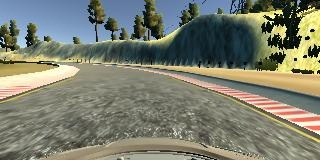
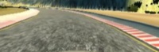

# **Behavioral Cloning**

## Goals of The Project

* Use the deep convolutional neural network to clone driving behavior.
* Use a car simulator to collect data and test networks.
* Use Keras and Tensorflow to build model, training.

## Code Structure

The main program is ./model.py

The image pre-processing and generator are ./generator.py

The modified drive file is ./drive

## Data Collection

For both tracks, we drive forward for two rounds and drive in reverse order for two rounds.

For track 1, several recovery drives are performed at places where there are sharp turns.

For track 1, 36993 images are captured, including images from the center, left, and right cameras.

For track 2, 42364 images are captured, including images from the center, left, and right cameras.

For images data from left and right cameras, their steering angles are adjusted. And then they are used for training the model.

## Data Preprocessing

We are doing three steps of data preprocessing.

The original image looks like:

First, the image is cropped to remove areas that are not useful for learning the behavior.

Second, the image is resized to 66 * 200 * 3 to meet the model requirement.

Finally, the image is converted to YUV color space.

## Data Augmentation

We perform three kinds of data augmentations randomly to generate 50% more data for training.

The three augmentations are horizontal flip, adjust brightness, and apply gaussian blur.

With the augmented data, we reduce the overfitting, the training is doing better.

## Model Architecture

We use the model developed by Nvidia. Bojarski, Mariusz, et al. "End to end learning for self-driving cars." arXiv preprint arXiv:1604.07316 (2016).

To reduce overfitting, a drop out layer is added before the flatten operation.

| Layer (type)        | Output Shape       | Param # |
|---------------------|--------------------|---------|
| lambda_1 (Lambda)   | (None, 66, 200, 3) | 0       |
| conv2d_1 (Conv2D)   | (None, 31, 98, 24) | 1824    |
| conv2d_2 (Conv2D)   | (None, 14, 47, 36) | 21636   |
| conv2d_3 (Conv2D)   | (None, 5, 22, 48)  | 43248   |
| conv2d_4 (Conv2D)   | (None, 3, 20, 64)  | 27712   |
| conv2d_5 (Conv2D)   | (None, 1, 18, 64)  | 36928   |
| dropout_1 (Dropout) | (None, 1, 18, 64)  | 0       |
| flatten_1 (Flatten) | (None, 1152)       | 0       |
| dense_1 (Dense)     | (None, 100)        | 115300  |
| dense_2 (Dense)     | (None, 50)         | 5050    |
| dense_3 (Dense)     | (None, 10)         | 510     |
| dense_4 (Dense)     | (None, 1)          | 11      |

Total params: 252,219
Trainable params: 252,219
Non-trainable params: 0

We use mean square error as the cost function. 

We use the Adam optimizer as an optimization tool. 

For all the data, we use 80 percent for training and 20 percent for validation.

We use the following hyperparameters for training.

learning rate = 0.0001

epochs = 20

batch size = 64

## Results

The training takes about 40 minutes for both tracks. model.h5 and track2model.h5 are generated for the test.

Video for track 1:

Video for track 2:

## Potential Shortcomings and Improvements

When training and testing two tracks, we find that the first track is more challenging than the second track. The second track is more complicated, however, there are more variations. There are left turn right turn with different curvatures. In addition to that, the lane in the second track is more clear than that in the first track. The model can learn to track the lane better. For the second track, the model works well trained with two sets of normal run data. For the first track, normal track run data is not sufficient for the model to learn a correct behavior at sharp turns. Several intentional recovery drives are performed to collect additional data for the model to learn how to recover.

In general, the model is doing good on the provided two tracks. To handle more challenging cases, we can collect more data.

In this training and testing, we did not create a separate testing data set, the simulator is used for verifying the data. We can improve the development efficiency by creating a separate test data set instead of using the simulator every time.